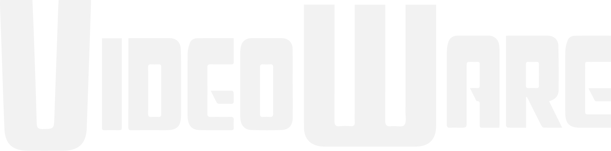
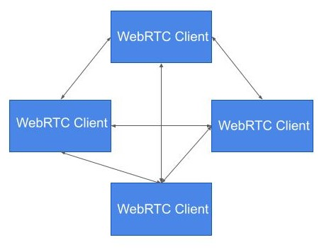
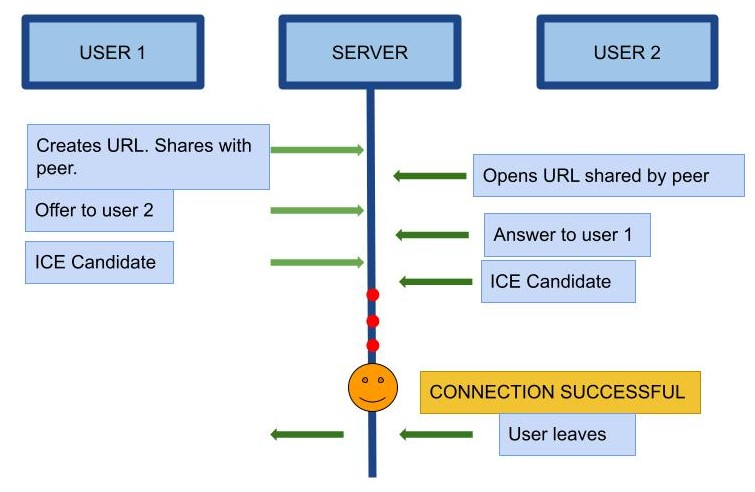
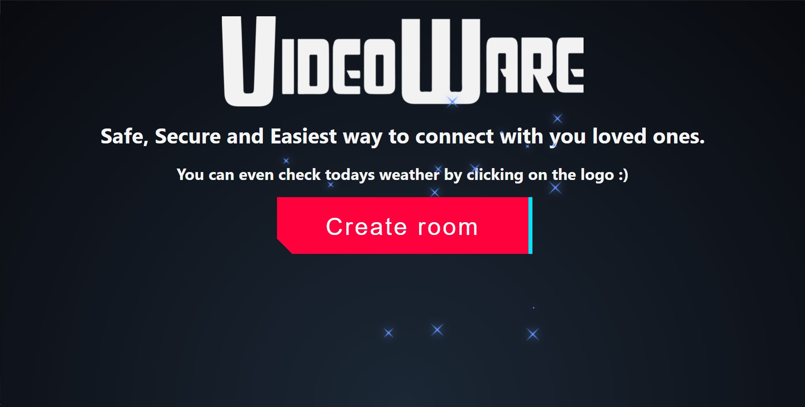
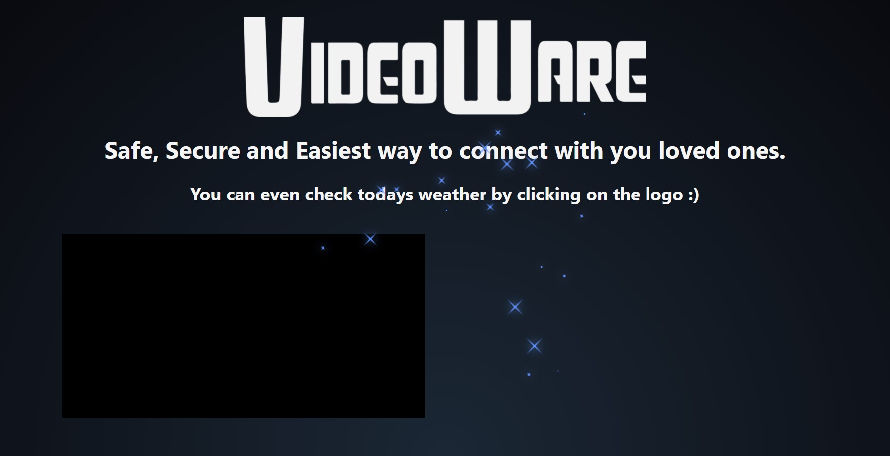
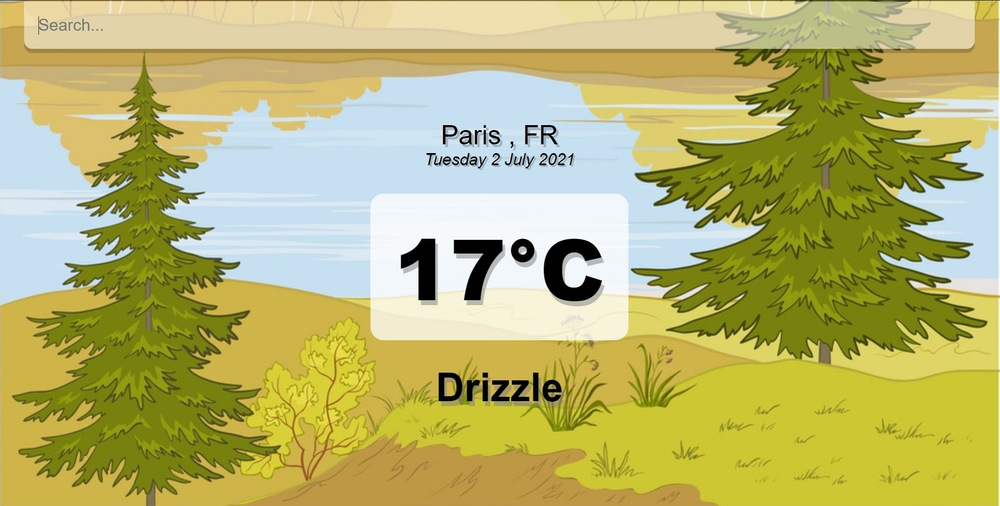

# A Clone of Microsoft Teams

This is a React project which uses WebRTC for Video Conferencing.

<!-- PROJECT LOGO -->
<br/>
<p align="center">
   

   <h3 align="center">Microsoft Engage 2021 Challenge</h3>
   <p align ="center">
   <br/>
   <a href="https://video-ware.herokuapp.com/">Live Site</a>
   </p>
   </p>


   <!-- TABLE OF CONTENT -->
   <details open="open">
   <summary>Table of Contents</summary>
   <ol>
    <li>
     <a href="#about-the-project">About The Project</a>
     <ul>
      <li><a href="#development-methodology">Development Methodology</a></li>
       </ul>
      <ul>
        <li><a href="#built-with">Built With</a></li>
      </ul>
    </li>
    <li><a href="#architecture">Architecture</a>
    <li>
      <a href="#getting-started">Getting Started</a>
      <ul>
        <li><a href="#pre-requisites">Pre-requisites</a></li>
        <li><a href="#installation">Installation</a></li>
      </ul>
    </li>
    <li><a href="#snapshots">Snapshots</a></li>
    <li><a href="#scope">Scope</a></li>
    <li><a href="#contact">Contact</a></li>
    <li><a href="#acknowledgements">Acknowledgements</a></li>
  </ol>
</details>


<!-- ABOUT THE PROJECT -->
## **About the Project**
Engage 2021 is a Engagement and Mentorship program created by Microsoft engineers, in association with Ace Hacker team, for engineering students.Through this initiative, students get a chance to be mentored by Microsoft and be a part of AMA Sessions, Webinars and Leader talks delivered by Microsoft employees. The challange was to **build a Microsoft Teams Clone** . It should be a fully functional prototype with at least one mandatory functionality - *a minimum of two participants should be able connect with each other using your product to have a video conversation*.[Microsoft Engage 2021](https://microsoft.acehacker.com/engage2021/?mc_cid=51cf8705a5&mc_eid=e7a7568555#challenge)


### **Development Methodology :**

### Scrum Methodology

Scrum is an **Agile** development methodology used in the development of software based on an iterative and incremental processes. Each iteration consists of two to four week sprints, where each sprint’s goal is to build the most important features first and come out with a potentially deliverable product.

### **Sprint Map**
 Below points provides insight to sprint wise progress and bugs:

- #### **Week 1** : 
    1.  Learn about developement.
    2.  Decide tech stack and architecture.
    3.  Learn **Node Js**.
    4.  Learn about Git and GitHub.

- #### **Week 2** : 
    1.  Work on the User Interface.
    2.  Research about extra features.
    3.  Exploration about WebRTC.
    #### *Bugs* : WebRTC implementation.

- #### **Week 3** :
    1.  Add extra feature (weather app)
    2.  Implementation of WebRTC.
    3.  Exploration about Servers.
    4.  Run application on local server.
    5.  Update UI.
    #### *Bugs* : Not working globally, bugs in server deployment.

- #### **Week 4** :  
    1.  Add app icon.
    2.  Server deployment on Heroku.
    3.  Global working(Testing on different networks).
    4.  Try to implement adapt feature.
    5.  Update README.
    6.  Create demo video.
    #### *Bugs* : Slow load time on some devices.


### **Built With**
* [React](https://reactjs.org/)
* [Socket.IO](https://socket.io/)
* [WebRTC](https://webrtc.org/)
* [Nodejs](https://nodejs.org/en/)
* [Weather API](https://openweathermap.org/api)

## **Architecture :**
Clone uses Peer to Peer mesh architecture. Mesh architecture provides group video call functionality. WebRTC is used for the real time media communication between devices. WebRTC is a fully peer-to-peer technology for the real-time exchange of audio, video, and data, with one central caveat. Making this into a group call in P2P translates into a mesh network, where every WebRTC client has a peer connection opened to all other clients directly. When dealing with WebRTC and indicating Peer to Peer mesh, the focus is almost always on media transport. The signaling still flows through servers as WebRTC doesn't provide signaling which is essential for establishing connection.
<p align="center">
   

First of all, each user registers with the server. Once users have registered, they are able to call each other. On creating a meet, a code is generated. User 1 makes an offer with all the users currently connected with this particular code. The other users should answer. Finally, ICE candidates are sent between users until they can make a connection.

PeerJS simplifies WebRTC peer-to-peer data, video, and audio calls. PeerJS wraps the browser's WebRTC implementation to provide a complete, configurable, and easy-to-use peer-to-peer connection API. Equipped with nothing but an ID, a peer can create a P2P data or media stream connection to a remote peer.


<p align="center">
   


<!-- GETTING STARTED -->
## **Getting Started**

### Pre-requisites
- [Basic setup of VSCode](https://code.visualstudio.com/download)

### Installation

- Install the [app]("https://video-ware.herokuapp.com/").

**(OR)**

1. Clone the repo
```sh
git clone https://github.com/dahiya-code/video-ware.git
```
2. Install dependencies for the source and client folder using 
```sh
yarn install
```
3. For source folder run in Command prompt
```sh
node server.js
```   
4. For client folder run in Command prompt
```sh
yarn start
```   
<!-- ## **Snapshots :**



 -->

   
<br/>

<!-- ROADMAP -->
## Scope
### Features
- Connectivity  for 4-5 participants
- Invite by meeting ID.
- Weather of any city in the world.


### Possible Improvements
- Clone uses publically available free stun/turn servers, custom and dedicated stun/turn servers can be used to improve cross network connection capabilities.
- SFU/MCU implementation can be used to reduce dependency on download/upload speed of individual network connection.
- Share screen feature can be added.
- Share link feature can be added.
- User Authentication will be added.
- Chat feature


<!-- ACKNOWLEDGEMENTS -->
## Acknowledgements
- [nodemon](https://www.npmjs.com/package/nodemon)
- [uuid](https://pub.dev/packages/uuid)
- [simple-peer](https://www.npmjs.com/package/simple-peer)
